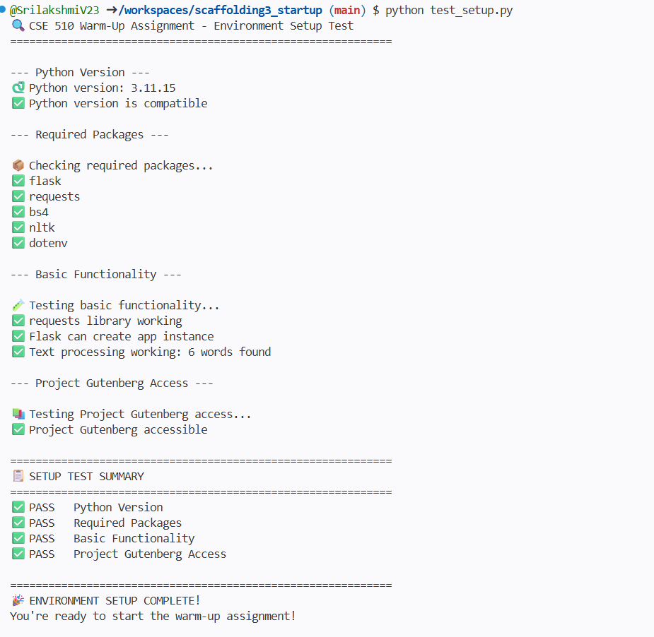
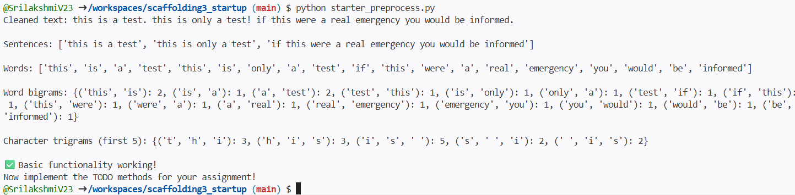
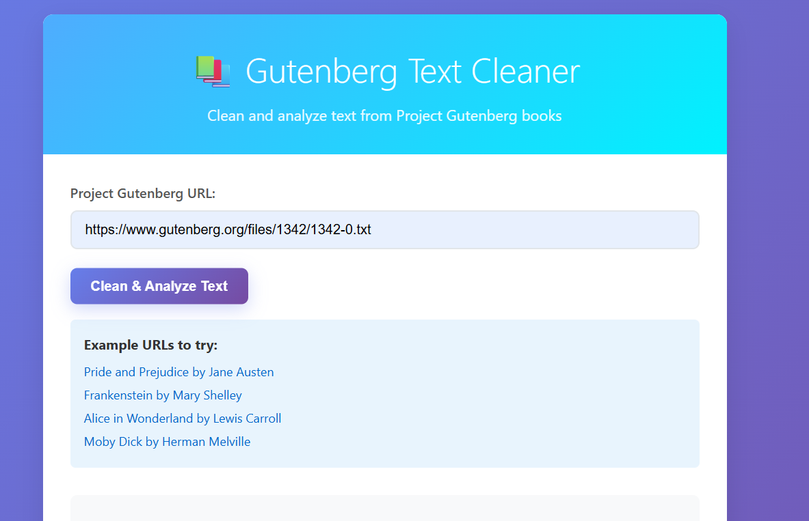
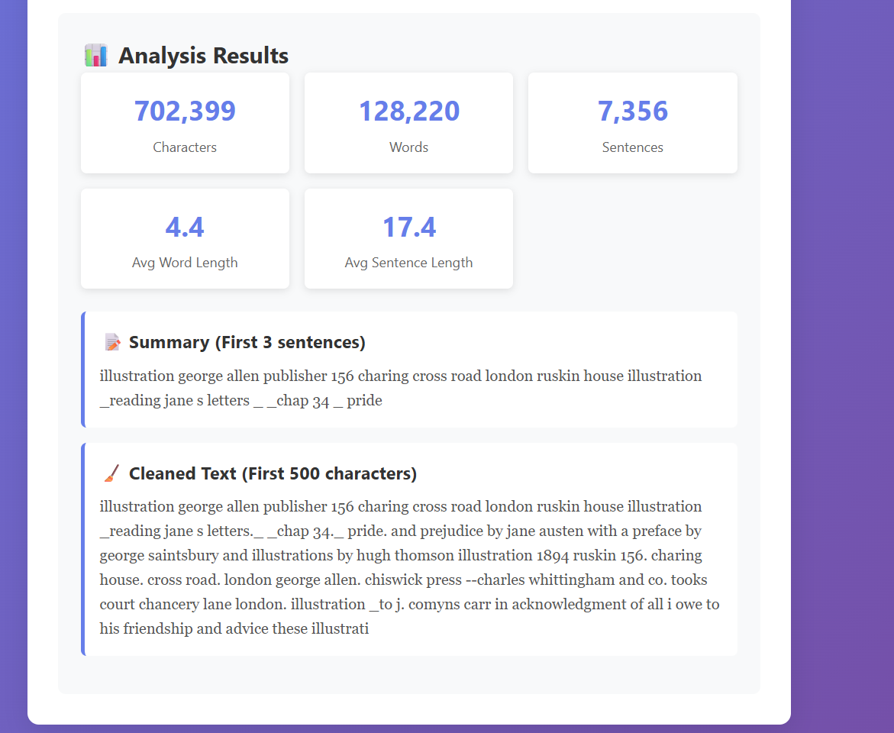
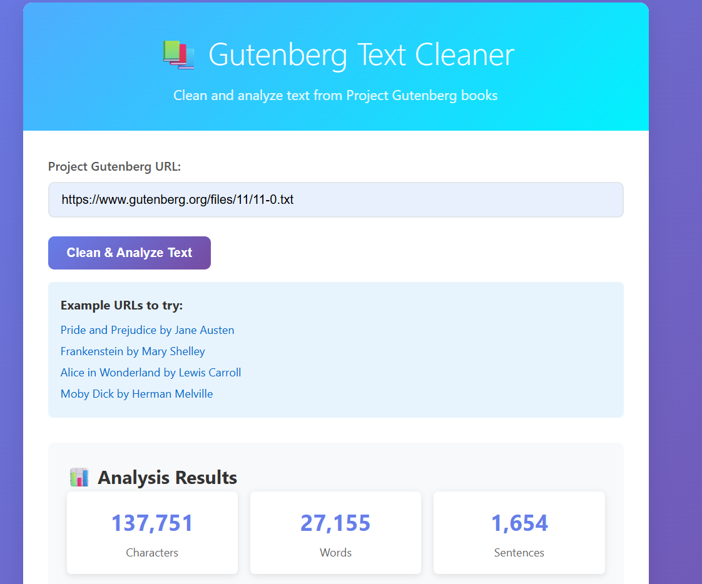
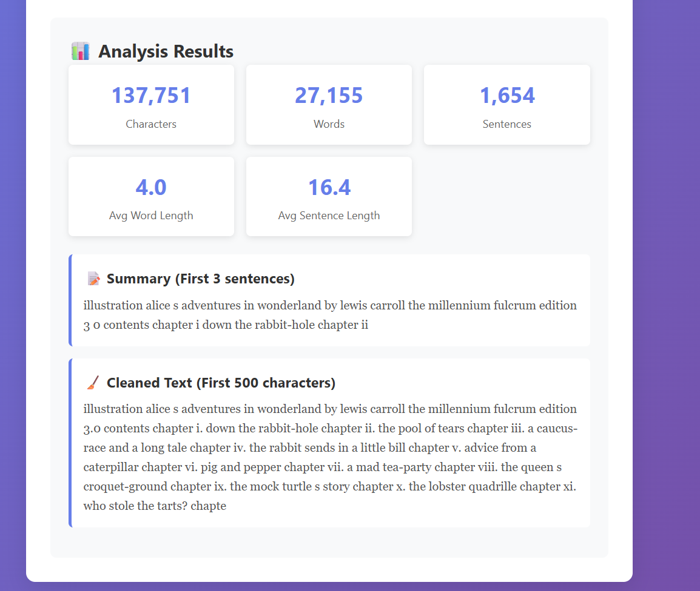
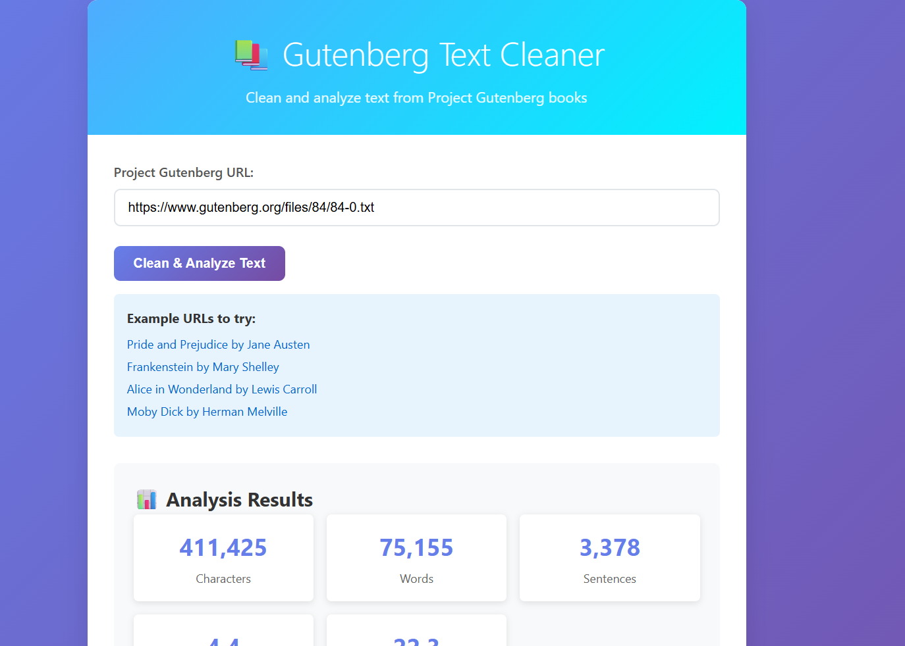
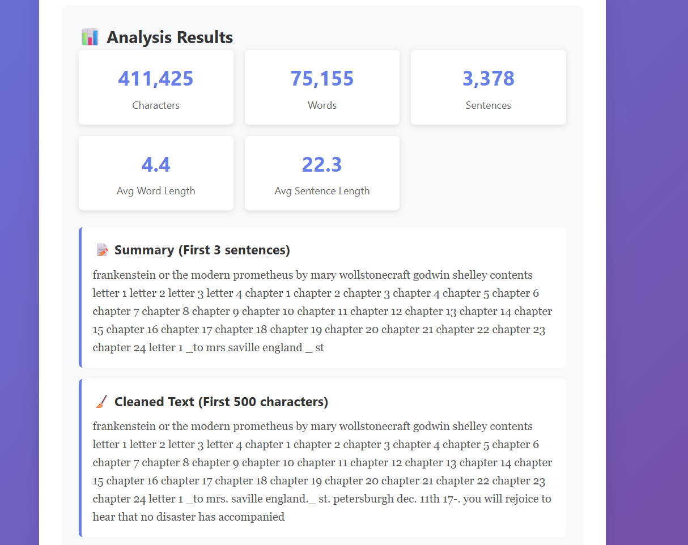

# CSE 510 Warm-Up Assignment: Text Preprocessing Web Service

In this assignment, I developed a Flask-based web application that processes text from Project Gutenberg books. The application accepts a .txt URL as input, downloads the book content, removes unnecessary header and footer sections, normalizes the text, calculates statistics, and generates a short summary. The results are displayed through a simple web interface.

This assignment helped me understand text preprocessing and API development using Flask and prepared me for the upcoming Shannon Information Theory assignment.

## 🎯 Assignment Overview

In this assignment, I implemented a web service that processes text from Project Gutenberg books. The application downloads book content from a .txt URL, removes unnecessary header and footer sections, normalizes the text, calculates statistics, and generates a short summary. The processed results are displayed through a Flask-based web interface.


## 🚀 Quick Start

### 1. Environment Setup

I verified the environment setup by running:

python test_setup.py


This confirmed that all required libraries were installed correctly and the system was ready to run the application.



```

### 2. Run the Application

After completing the implementation, I started the Flask server using:

python app.py

Then I opened the application in the browser at:

http://localhost:5000

The interface successfully allowed me to test Project Gutenberg text URLs and view processed results.


### 3. Test the Interface

After running the Flask application, I tested the web interface using several Project Gutenberg book URLs such as:

- Pride and Prejudice by Jane Austen
- Frankenstein by Mary Shelley
- Alice in Wonderland by Lewis Carroll
- Moby Dick by Herman Melville

For each book, the application successfully downloaded the text, removed the header and footer sections, calculated statistics, generated a short summary, and displayed the cleaned text preview in the browser.

## Implementation Details

As part of this assignment, I completed the required preprocessing methods in 'starter_preprocess.py'.

### fetch_from_url(url)

I implemented this method to download text content from a Project Gutenberg '.txt' file URL. The function first checks whether the provided URL ends with '.txt', then retrieves the text using a request call and returns the raw content. I also handled possible network-related errors to make the function more reliable.


### get_text_statistics(text)

I implemented this function to calculate important statistics from the cleaned text. The function returns the total number of characters, total number of words, total number of sentences, average word length, average sentence length, and the top 10 most common words. These values help understand the structure of the text before further analysis.

### create_summary(text, num_sentences = 3)

I implemented this function to generate a short extractive summary of the text. It selects the first three sentences from the cleaned text and returns them as a single string. This provides a quick preview of the book content.

### Flask API Endpoints Implemented

As part of this assignment, I implemented the required API endpoints in 'app.py' to connect the preprocessing logic with the web interface.

#### POST /api/clean

This endpoint accepts a Project Gutenberg '.txt' file URL as input. It downloads the book content, removes the header and footer sections, normalizes the text, calculates statistics, and generates a short summary. The endpoint returns a JSON response containing a cleaned text preview (first 500 characters), statistics, and summary.

Example input:

{
"url": "https://www.gutenberg.org/files/1342/1342-0.txt"
}

Example output includes:

- cleaned text preview
- text statistics
- generated summary

#### POST /api/analyze

This endpoint accepts raw text input and returns statistical analysis of the text. It calculates total characters, total words, total sentences, average word length, average sentence length, and the most common words. This endpoint is useful for analyzing text directly without downloading it from a URL.


### Part 4: Frontend Integration

### Frontend Integration

I completed the frontend integration in 'templates/index.html' by implementing the JavaScript form submission handler and connecting it with the Flask backend API.

The interface accepts a Project Gutenberg '.txt' URL from the user and sends a request to the '/api/clean' endpoint using the fetch API. After receiving the response, the application displays the cleaned text preview, statistics, and generated summary directly on the webpage.

I also handled error responses so that the interface shows appropriate messages if an invalid URL is entered or if the request fails.

## Testing the Implementation

After completing the preprocessing methods and API endpoints, I tested the application manually by running the Flask server using:

python app.py

Then I opened the web interface at:

http://localhost:5000


I tested the application using several Project Gutenberg '.txt' book URLs. For each test case, the application successfully downloaded the text, removed the header and footer sections, calculated statistics, generated a short summary, and displayed the cleaned text preview in the browser.

The results confirmed that the preprocessing pipeline and API endpoints were working correctly.

## Code Testing

After implementing the required preprocessing methods in 'starter_preprocess.py', I tested the functionality by running:

python starter_preprocess.py

This verified that tokenization, normalization, and statistics generation were working correctly.


Next, I tested the complete web application by running:

python app.py

Then I opened the browser at:

http://localhost:5000

and tested the application using multiple Project Gutenberg `.txt`book URLs. The system successfully returned cleaned text previews, statistics and summaries for all tested inputs.

aand tested the application using multiple Project Gutenberg `.txt` book URLs. The system successfully returned cleaned text previews, statistics and summaries for all tested inputs.
https://www.gutenberg.org/files/1342/1342-0.txt




https://www.gutenberg.org/files/11/11-0.txt




https://www.gutenberg.org/files/84/84-0.txt




## 📁 Project Structure

scaffolding3_startup/
├── README.md       # Project documentation
├── requirements.txt      # Python dependencies
├── test_setup.py        # Environment validation script
├── app.py            # Flask application with API endpoints implemented
├── starter_preprocess.py          # Text preprocessing functions implemented
├── screenshot.png           # Screenshot of working application output
└── templates/
└── index.html          # Web interface connected to backend API


## What I Learned From This Assignment

Through this assignment, I learned how to work with text preprocessing using Python and Flask. I implemented functions to fetch text from Project Gutenberg URLs, clean unnecessary header and footer content, normalize text, and calculate useful statistics such as word count and sentence count.

I also learned how to create Flask API endpoints and connect them with a frontend interface using JavaScript. This helped me understand how backend processing and frontend interaction work together in a web application.

Overall, this assignment helped me prepare for the upcoming Shannon Information Theory assignment where similar preprocessing steps will be used again.


## Issues I Faced While Running the Project

While working on this assignment, I faced a few small setup issues:

- Missing packages initially, which I fixed using 'pip install -r requirements.txt'
- Sometimes Project Gutenberg URLs took longer to load
- Flask port already running once, which I resolved by restarting the server

After fixing these, the application worked correctly.


## 📚 Resources

- [Flask Documentation](https://flask.palletsprojects.com/)
- [Requests Library](https://requests.readthedocs.io/)
- [Project Gutenberg](https://www.gutenberg.org/)
- [Regular Expressions in Python](https://docs.python.org/3/library/re.html)